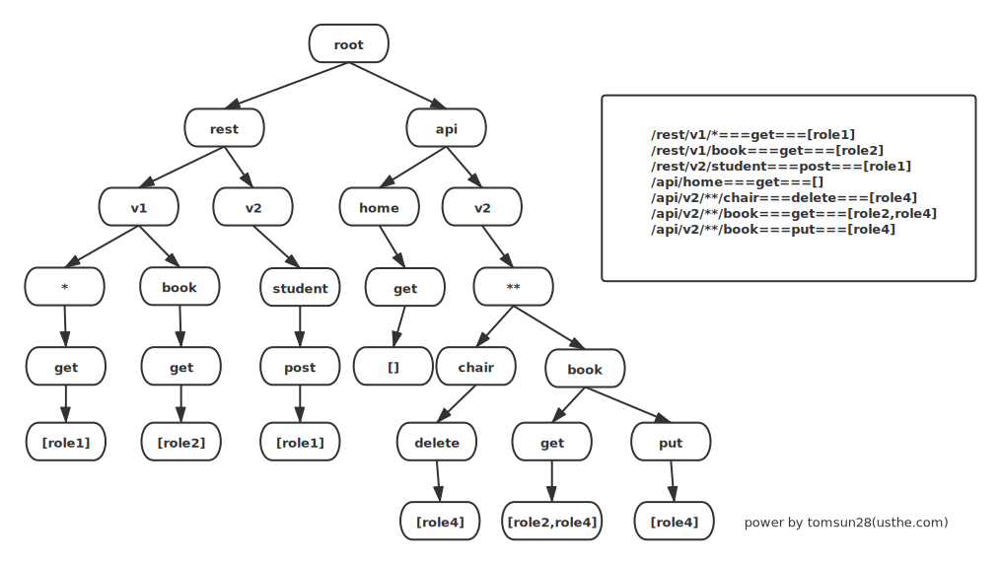

  

# sureness-gateway   | [中文文档](README_CN.md)

> Spring Gateway integrates Sureness to provide API authentication and authorization at the gateway.

 

**Home Page: [usthe.com/sureness](https://usthe.com/sureness) or [su.usthe.com](https://su.usthe.com/)**  

## 📫 Background   

In the mainstream web architecture, how to protect the REST API provided by the back-end through effective and fast authentication has become particularly important.     
For existing frameworks, whether it is apache shiro which does not natively support rest, or deeply bound spring and steep learning curve of spring security are not our ideal framework.   
Ever since sureness was born, we hope to solve these, provide a **REST API**, **no framework dependency**, can **dynamically modify permissions**, **multiple authentication policies**, **faster**, **easy to use and extend** security framework.        

## 🎡 Introduction

> [Sureness](https://github.com/usthe/sureness) is a simple and efficient open-source security framework that focus on the protection of REST API.  
> Provide authentication and authorization, based on RBAC.   
> No specific framework dependency (supports Javalin, Spring Boot, Quarkus, Ktor, and more).    
> Supports dynamic modification of permissions.   
> Supports WebSockets and mainstream HTTP containers (Servlet and JAX-RS).    
> Supports JWT, Basic Auth, Digest Auth, and can be extended to support custom authentication methods.    
> High performance due to dictionary matching tree.      
> Good extension interface, demos and documentation.

> Sureness has a sensible default configuration, is easy to customize, and is not couple to any one framework, which enables developers to quickly and safely protect their projects in multiple scenarios.

##### 🔍 Compare     

| ~         | sureness | shiro | spring security |
| ---       | ---      | ---   | --- |
| **multi framework support**  | support      | support need modify   | not support |
| **REST API** | support | support need modify   | support |
| **websocket** | support | not support   | not support |
| **path match**  | dictionary matching tree | ant match | ant match |
| **annotation support**    | support      | support      | support |
| **servlet**    | support      | support      | support |
| **jax-rs**     | support      | not support    | not support |
| **dynamic modification of permissions** | support | support need modify | support need modify |
| **performance** | fast | slower | slower|
| **learning curve** | simple | simple | steep|

##### 📈 Benchmark  

  

**Benchmark test shows sureness to lose 0.026ms performance compared to frameless application, shiro lose 0.088ms, spring security lose 0.116ms.**    
**In contrast, sureness basically does not consume performance, and the performance (TPS loss) is 3 times that of shiro and 4 times that of spring security.**      
**The performance gap will be further widened as the api matching chain increases.**      

Detail see [Benchmark Test](https://github.com/tomsun28/sureness-shiro-spring-security-benchmark)       

##### ✌ Framework Sample Support  

- [x] sureness integration springboot sample(configuration file scheme) [sample-bootstrap](sample-bootstrap)   
- [x] sureness integration springboot sample(database scheme) [sample-tom](sample-tom)  
- [x] sureness integration quarkus sample [sample-quarkus](samples/quarkus-sureness)  
- [x] sureness integration javalin sample [sample-javalin](samples/javalin-sureness)    
- [x] sureness integration ktor sample [sample-ktor](samples/ktor-sureness)   
- [x] sureness integration spring webflux sample [sample-spring-webflux](samples/spring-webflux-sureness)   
- [x] sureness integration session sample [sureness-session](samples/sureness-session)
- [x] sureness integration redis cache session sample [sureness-redis-session](samples/sureness-redis-session)
- [x] more samples todo

#### 💪 Why Is High Performance  

   

